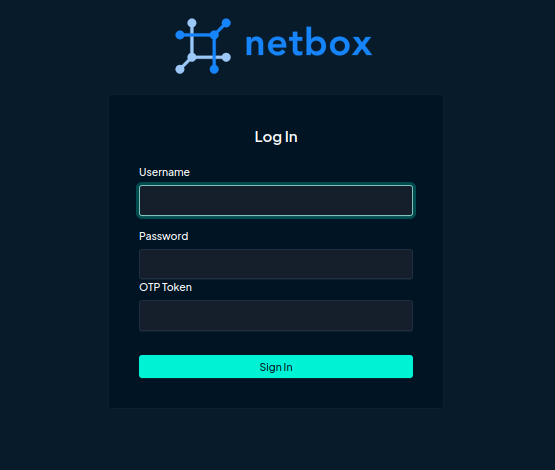
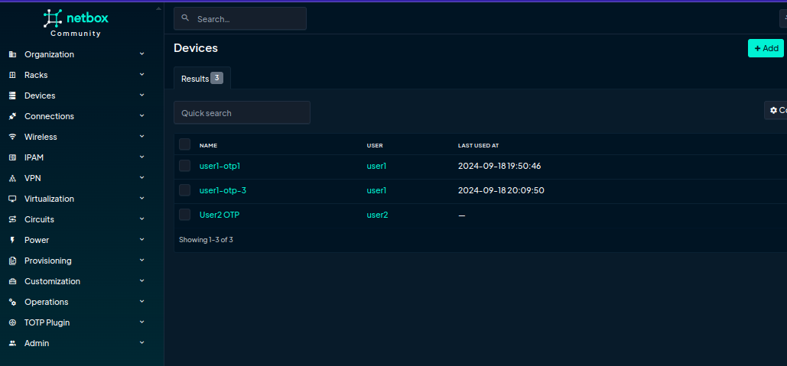
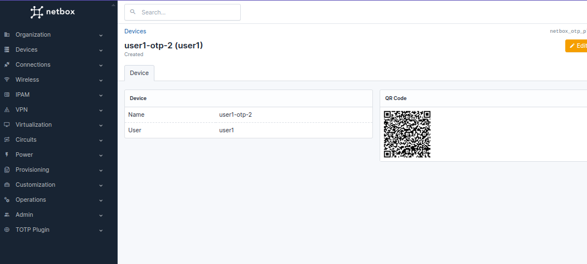

# Netbox OTP Plugin

Two-factor authentication for [NetBox](https://github.com/netbox-community/netbox). The plugin provides user OTP token verification and OTP device management is provided and bases on [django-otp](https://github.com/django-otp/django-otp) with Time-based One-time Password algorithm.



## Compatibility

| NetBox Version| Plugin Version|
|---------------|---------------|
| 4.1           | 1.3.0+        |
| 4.0           | 1.1.0+        |
| 3.1+          | 1.0.7         |


## Installation

The plugin is available as a [Python package](https://pypi.org/project/netbox-otp-plugin/) in pypi and can be installed with pip
```
source /opt/netbox/venv/bin/activate
python -m pip install netbox-otp-plugin
# or
# python -m pip install netbox-otp-plugin==<version>
```

Enable the plugin in /opt/netbox/netbox/netbox/configuration.py:
```
PLUGINS = ['netbox_otp_plugin']
```

Run migration:
```
./manage.py makemigrations netbox_otp_plugin
./manage.py migrate netbox_otp_plugin
```

To ensure the plugin is automatically re-installed during future upgrades, create a file named `local_requirements.txt` (if not already existing) in the NetBox root directory (alongside `requirements.txt`) and append the `netbox-otp-plugin` package:

```no-highlight
echo netbox-otp-plugin >> local_requirements.txt
```

## Configuration

An OTP device can be attached to a user on your NetBox site or using the command:
```
./manage.py addtotp <username>
```
Then you will see a QR code that you can add to an TOTP authenticator.

To reset user OTP device use the site or the command:
```
./manage.py resettotp <username>
```

The plugin has additional options:
* `otp_required` - if set to True then two-factor authentication will be always required even if a user doesn't have an OTP device yet. False value required to authenticate users only with an OTP device attached only. Default: `True`.
* `issuer` - the issuer parameter for the otpauth URL (see more https://github.com/google/google-authenticator/wiki/Key-Uri-Format). Default: `'Netbox'`.

### Example

```
PLUGINS_CONFIG = {
    'netbox_otp_plugin': {
        'otp_required': False,
        'issuer': 'MyOrgNetbox'
    }
}
```

### Screenshots




